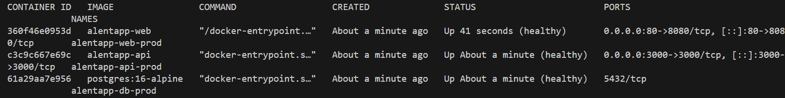
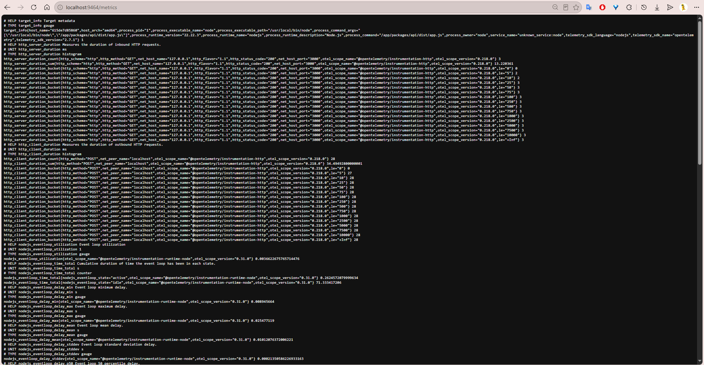
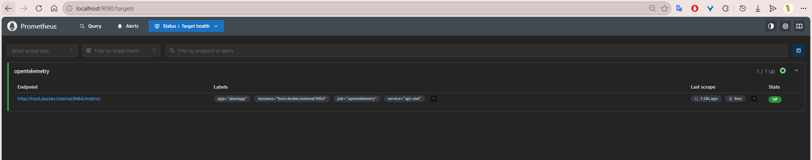
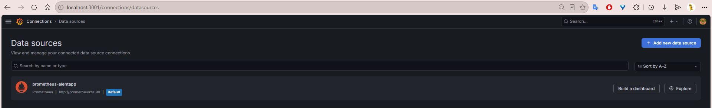
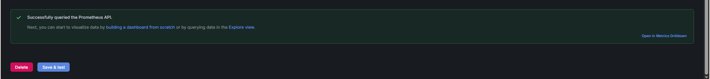
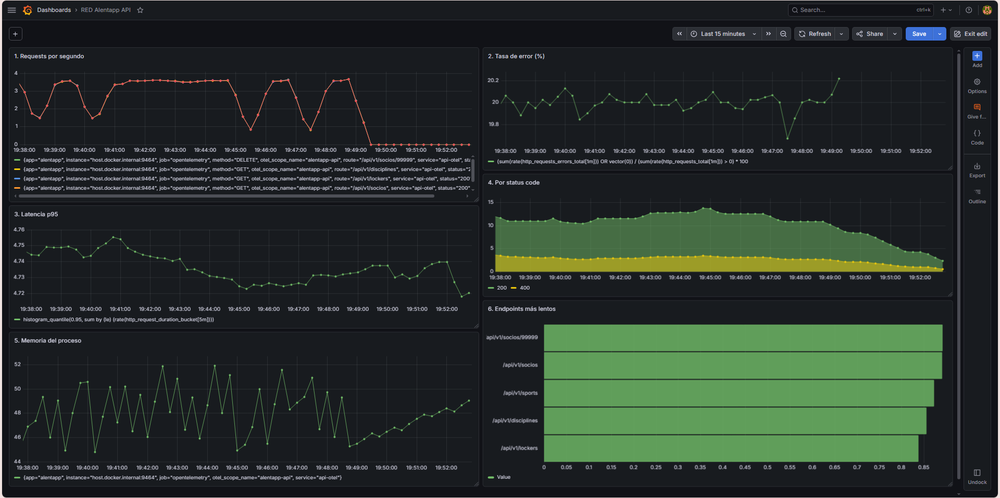

# Informe de Verificaciones y documentación — Fase 4

**Grupo:** 1  
**Proyecto:** alentapp

## 4.1. Verificación técnica

| Métrica | Antes (desarrollo) | Después (producción) | Mejora |
|---|---|---|---|
| Tamaño imagen API | 421 MB | 165 MB | 61% |
| Tamaño imagen Web | 220MB | 23.3MB | 89% |
| Tiempo de startup API | 0m19.198s | 0m13.528s | 29% |
| Memoria API (idle) | 107.6 MB (sin límite) | 72 MB / 512 MiB | 33% |
| Memoria Web (idle) | 376.7MiB / 6.649GiB | 12.72MiB / 256MiB | 96% |
| Endpoint API accesible | ✓ 200 OK | ✓ 200 OK | — |
| Frontend vía nginx | — | ✓ Documento HTML* | — |

```HTML
comando: curl localhost/

<!doctype html>
<html lang="en">
  <head>
    <meta charset="UTF-8" />
    <link rel="icon" type="image/svg+xml" href="/favicon.svg" />
    <meta name="viewport" content="width=device-width, initial-scale=1.0" />
    <title>web</title>
    <script type="module" crossorigin src="/assets/index-BJA5EXvJ.js"></script>
  </head>
  <body>
    <div id="root"></div>
  </body>
</html>
```

## 4.2. Verificación de seguridad

| Medida de seguridad | Estado | Verificación |
|---|---|---|
| API corre con usuario no-root | ✓ OK | `docker exec alentapp-api-prod whoami` → `node` |
| Web corre con usuario no-root | ✓ OK | `docker exec alentapp-web-prod whoami` → `nginx` |
| npm ausente en imagen final | ✓ OK | `docker exec alentapp-api-prod which npm` → vacío |
| tsc ausente en imagen final | ✓ OK | `docker exec alentapp-api-prod which tsc` → vacío |
| Filesystem read-only activo | ✓ OK | `docker exec alentapp-api-prod touch /test` → falla |
| Filesystem read-only activo | ✓ OK | `docker exec alentapp-web-prod touch /test` → falla |
| Variables sensibles vía .env | ✓ OK | no hardcodeadas en Dockerfile ni docker-compose |
| Capabilities mínimas (cap_drop: ALL) | ✓ OK | configurado en docker-compose.prod.yml |
| Healthchecks funcionando | ✓ OK | `docker ps` → los 3 contenedores en estado `healthy`| 



## 4.3 Verificación de Observabilidad

### Detalle de validación técnica de los requerimientos

**1. OpenTelemetry exporta métricas en :9464/metrics**
Se verificó accediendo directamente al endpoint expuesto por el SDK. Se observan las métricas crudas (como `http_requests_total` o `http_request_duration`) listas para ser recolectadas.



**2. Prometheus scrapea correctamente el endpoint OTLP**
Se analizó el panel de *Targets* de la interfaz de Prometheus (`localhost:9090/targets`). Se comprobó que el job configurado en `prometheus.yml` está leyendo el puerto 9464 del contenedor de la API y reporta un estado de salud **UP**.



**3. Grafana tiene al menos un datasource Prometheus configurado**
Se estableció la conexión interna entre el contenedor de Grafana y el de Prometheus a través de la URL `http://prometheus:9090`. La prueba de conexión arrojó un resultado exitoso.





**4. El dashboard RED tiene 6 paneles funcionales**
Se importó el esquema JSON del dashboard validando que los paneles de Requests por segundo, Tasa de error, Latencia, Status code, Memoria y Endpoints más lentos ejecutan sus consultas PromQL de manera exitosa y sin errores de datos vacíos ("No data").

**5. Los gráficos responden al tráfico generado**
Al inyectar tráfico masivo mediante el bucle de consultas *curl*, los gráficos en formato *Time series* abandonaron su estado de reposo y dibujaron la fluctuación del tráfico en tiempo real de forma inmediata.

**6. Las métricas de error reflejan los 4xx/5xx**
Al forzar deliberadamente un error de negocio (Intentar eliminar un socio inexistente con código 404), la métrica generada por `errorCounter` fue capturada por Grafana, elevando el gráfico de la Tasa de error de manera proporcional al total de las consultas.

*(La evidencia visual que respalda el correcto funcionamiento descrito en los puntos 4, 5 y 6 se encuentra en la captura general del Dashboard RED adjunta al final de este apartado).*

## 4.4 Documentación de decisiones

### 4.4.1 Arquitectura final

La solución se basa en una arquitectura de **micro-contenedores orquestados** mediante `docker-compose`, diseñada bajo principios de *seguridad por diseño* y *aislamiento de servicios*. La infraestructura se segmenta en tres planos críticos:

1. **Plano de Ejecución (App Plane):** Compuesto por tres servicios interconectados (`alentapp-api`, `alentapp-web`, `alentapp-db`). La comunicación es estrictamente interna a través de una red Bridge personalizada (`alentapp-prod-net`), lo cual asegura que los servicios no sean accesibles desde el exterior, salvo a través de los puertos expuestos (`3000` y `5173`).
2. **Plano de Observabilidad (Monitoring Plane):** Desacoplado totalmente del flujo de datos principal. Los contenedores `Prometheus` y `Grafana` operan de forma autónoma, recolectando métricas mediante *pull* desde el endpoint `/metrics` de la API (vía OTel). Este desacoplamiento garantiza que, ante una saturación de tráfico o una caída del monitoreo, el rendimiento de la aplicación nunca se vea comprometido.
3. **Plano de Persistencia:** Basado en `PostgreSQL` con volúmenes de Docker (`pgdata`) para garantizar la durabilidad de los datos, configurado con un `healthcheck` que impide el arranque de la API hasta que la base de datos esté lista, evitando errores de inicialización.

### Puntos clave de esta arquitectura:

* **Encapsulamiento:** Ningún servicio conoce la infraestructura subyacente; solo conocen los *endpoints* definidos por nombre de servicio gracias al DNS interno de Docker.
* **Immutabilidad:** Los contenedores de ejecución (API y Web) son inmutables y de solo lectura (`read-only`), lo que impide la inyección de código o la modificación maliciosa en tiempo de ejecución.
* **Separación de responsabilidades:** La configuración de observabilidad se inyecta como volumen externo, permitiendo modificar las reglas de monitoreo sin necesidad de reconstruir la imagen de la aplicación.

### 4.4.2 Decisiones técnicas

**Arquitectura Multi-stage Build**

- Qué decisión se tomó: Dividir el proceso de construcción en tres etapas independientes: deps, build y runtime.

- Por qué se hizo: Para separar las herramientas que se necesitan para construir la app de las que se necesitan para ejecutarla. Esto permitió que la imagen final sea ultra ligera.

- Impacto: Menor consumo de almacenamiento en el servidor, despliegues más rápidos y mayor eficiencia de red.

**Implementación de Métricas RED (Requests, Errors, Duration)**

- Qué decisión se tomó: Adoptar el modelo RED para la instrumentación de los controladores de la API.

- Por qué se hizo: Porque permite monitorear de forma exhaustiva el rendimiento: el volumen de tráfico (Requests), la calidad del servicio (Errors) y la experiencia del usuario final según el tiempo de respuesta (Duration).

- Impacto: Visibilidad total sobre el estado operativo del sistema, permitiendo detectar cuellos de botella y fallas funcionales en tiempo real sin tener que revisar logs manualmente.

**Nginx**

- Qué decisión se tomó: Usar nginx para servir el frontend en producción, reemplazando a Vite.

- Por qué se hizo: Nginx es más liviano y eficiente para servir archivos estáticos que node, ya que está diseñado para ello.

- Impacto: El tamaño de la imagen presenta un 89% de mejora contra la de node.

### 4.4.3 Desafíos y Complicaciones Encontradas

Durante el desarrollo de la implementación y verificación, el equipo se enfrentó a diversos desafíos técnicos que requirieron investigación y depuración. A continuación, se detallan las principales complicaciones resueltas por área de responsabilidad:

#### API Dockerfile

* **Compilación previa de shared:** En TypeScript, los enums generan código JavaScript real al compilarse. Node.js en producción no entiende el TypeScript crudo de shared. 
Por lo tanto, primero se tiene que compilar shared, luego se inyecta en la API, y finalmente se usa un comando sed en el Dockerfile para "engañar" al package.json de producción y redirigir el punto de entrada (main) desde el archivo .ts original hacia el .js compilado en la carpeta dist/.

* **Migraciones con Prisma:** Se tuvo que programar un script de Bash (docker-entrypoint sh) que actúa como intermediario. Al encender el contenedor, este script frena momentáneamente el arranque de la app, ejecuta de forma segura npx prisma migrate deploy, y recién cuando la base de datos está lista, levanta el proceso de Node.js. 

* **Eliminación de Herramientas Heredadas de la Imagen Base:** La imagen oficial de Node (node:22-alpine) viene por defecto con npm y npx preinstalados. Para producción, esto representa un problema de seguridad (mayor superficie de ataque) y un peso innecesario. La complicación radicó en tener que limpiar manualmente el entorno de ejecución, forzando la eliminación de estos binarios del sistema mediante comandos rm -rf directos a los directorios de la imagen base antes de dar por terminada la construcción del contenedor.

#### Web Dockerfile y Nginx
* **Errores de TypeScript en el build:** Al ejecutar el build de producción por primera vez, el stage 2 falló porque el script build del `package.json`corre `tsc -b` antes de vite build. El compilador de TypeScript detectó errores de tipos en varios archivos (`Discipline.tsx`, `Lockers.tsx`, `Payments.tsx`, etc.). 
Para solucionarlo eliminamos el comando tsc -b en la configuración de `web/package.json` así no se devolverán esos errores en el build. Quedando como pendiente implementar la solución más adecuada que sería arreglar correctamente los tipos de datos en las vistas y hacer `tsc -b` en build.
* **Nginx no levantaba con read_only: true:** Al momento de correr de levantar el contenedor ocurría un fallo porque nginx necesitaba crear carpetas temporales y escribir el log de errores, siendo impedido por la configuración de `read_only`. La solución fue cambiar la imagen por `nginxinc/nginx-unprivileged`, agregar entradas tmpfs en el docker-compose.prod.yml para las carpetas temporales de nginx (`/var/cache/nginx`, `/var/run`, `/tmp`, `/var/log/nginx`), y redirigir los logs de nginx a stdout/stderr en el nginx.conf.
* **Problema con la URL de la API en producción:** Al construir la imagen de producción del frontend, surgió un problema con la URL de la API ya que usábamos localhost, y este desde el punto de vista del browser es la máquina del usuario final, no el servidor donde corre la API.
La solución fue configurar nginx como proxy inverso mediante el bloque location `/api/` en el nginx.conf, que intercepta las requests que empiezan con `/api/` y las redirige internamente al contenedor de la API. Tambien se definió `VITE_API_URL=/api/v1` en el docker-compose.prod.ym para que el frontend use la ruta relativa `/api/v1` en lugar de `http://localhost:3000/api/v1`.


#### Docker Compose de Producción
* **Sobreescritura del ciclo de vida (Exit Code 1):** El contenedor de la API fallaba en el inicio debido a que el archivo Compose tenía una línea command que entraba en conflicto y anulaba el ENTRYPOINT del Dockerfile prod. Se arregló eliminando comandos redundantes y respetando la delegación del arranque a la propia imagen.
* **Mapeo de puertos para métricas (Port Binding):** Durante la integración de OpenTelemetry, la recolección de datos fallaba porque el puerto interno del SDK (9464) no estaba expuesto hacia el host en el Compose de producción. Se resolvió añadiendo el mapeo explícito en la configuración de la API para permitir que Prometheus pudiera acceder al endpoint de métricas.
* **Nombrado explícito y caché de imágenes locales:** Al utilizar el bloque build para compilar los contenedores, las imágenes generadas quedaban con nombres dinámicos, dificultando su identificación. Se solucionó agregando image: alentapp-api:prod y image: alentapp-web:prod junto al contexto de construcción, forzando a Docker Compose a etiquetar las imágenes resultantes de forma predecible.

---

#### Instrumentación OpenTelemetry
* **Divergencia en la contabilización de peticiones (Fidelidad de datos):** Se detectó que las peticiones con error no siempre se registraban correctamente, sesgando las métricas de tráfico. Se centralizó la lógica de registro en el bloque `finally` de cada controlador mediante métodos auxiliares, garantizando que el total de *requests* sea siempre la suma exacta de éxitos y fallos.
* **Conflictos de tipos y auto-instrumentación:** La integración del `NodeSDK` presentó conflictos con las definiciones de tipos de TypeScript. Se resolvió mediante la inicialización explícita del `MeterProvider` y un *wrapper* para los contadores, preservando el tipado estricto del proyecto.
* **Medición inteligente de memoria (ObservableGauge):** En lugar de medir cuánta RAM gasta el servidor en cada consulta (lo que haría que la API se ponga lenta), implementamos un medidor que "espiá" la memoria cada cierto tiempo. Usamos una función que le entrega el dato a Prometheus solo cuando él lo pide, evitando así que el servidor pierda potencia procesando mediciones innecesarias.

#### Prometheus y Dashboard Grafana
* **Tolerancia cero a errores de sintaxis (YAML):** Durante la configuración inicial de `prometheus.yml`, un error mínimo de indentación en la propiedad `labels` provocó que el contenedor de Prometheus fallara silenciosamente al iniciar. Esto derivó en un error de DNS (`no such host`) en Grafana que requirió revisar el estado de los contenedores para aislar la falla.
* **Manejo de valores nulos en PromQL:** Al diseñar el panel de "Tasa de error", el gráfico arrojaba "No data" cuando la API operaba de forma 100% sana. Se debió investigar y modificar la consulta matemática agregando una validación de fallback (`OR vector(0)` y `> 0`) para evitar que la base de datos de Prometheus colapsara al intentar ejecutar una división por cero.
* **Saturación de renderizado en paneles:** El panel de "Endpoints más lentos" inicialmente intentaba renderizar el historial continuo del Top K, generando una saturación visual incomprensible. Se resolvió la complicación modificando la estructura de la consulta en Grafana a formato `Table` y forzando una evaluación `Instant`, permitiendo visualizar únicamente la fotografía del estado actual de cinco endpoints.

---

### 4.4.4 Grafana (Dashboard RED)

Para verificar el correcto funcionamiento del pipeline de telemetría (OpenTelemetry $\rightarrow$ Prometheus $\rightarrow$ Grafana), se sometió a la API productiva a una prueba de carga controlada. Se utilizó un script automatizado que generó un flujo constante de tráfico sano (códigos 200) intercalado con peticiones de borrado inválidas (códigos 400/404) para forzar fallos en los controladores.

A continuación se presenta la evidencia de la reacción de la infraestructura ante el estrés:



Script utilizado:

```bash
for i in {1..300}; do
  # Tráfico sano (Éxitos 200)
  curl -s http://localhost:3000/api/v1/socios > /dev/null
  curl -s http://localhost:3000/api/v1/sports > /dev/null
  curl -s http://localhost:3000/api/v1/lockers > /dev/null
  curl -s http://localhost:3000/api/v1/disciplines > /dev/null
  
  # Tráfico roto (DELETE a un ID que no existe -> Error 400/404 real)
  curl -X DELETE -s http://localhost:3000/api/v1/socios/99999 > /dev/null
  
  sleep 0.05
done
```

Al analizar la captura del dashboard en tiempo real, se validaron los siguientes comportamientos:

1. **Requests por segundo:** La métrica `rate` capturó instantáneamente el inicio del ataque de tráfico simulado, graficando el incremento sostenido de peticiones hacia la API.
2. **Tasa de error (%):** El panel reflejó la exactitud de la instrumentación. El script de estrés enviaba 1 error por cada ciclo de 5 peticiones totales (4 éxitos y 1 fallo). La fórmula PromQL ejecutada por Grafana calculó correctamente esta proporción absoluta ($1 / 5$), mostrando una tasa de fallo que se estabilizó de forma precisa y constante en el 20%.
3. **Latencia p95:** El histograma calculó correctamente la *Duration*, permitiendo observar que, a pesar de la ráfaga de peticiones, el 95% de los usuarios experimentaron tiempos de respuesta óptimos de unos pocos milisegundos.
4. **Por status code:** El panel agrupó exitosamente la totalidad de las peticiones registradas en `http_requests_total` utilizando la etiqueta `status`. El panel renderiza un gráfico de área apilada (*Stacked Area*) que permite visualizar la proporción exacta del tráfico: una base dominante de peticiones exitosas (códigos 200/201/204) y, superpuesta a esta, la franja correspondiente a los errores (códigos 400/404) inyectados por el script.
5. **Memoria del proceso:** El medidor de memoria demuestra que la API es estable a nivel de recursos. Durante la prueba de estrés, el consumo de RAM no se disparó sin control ni colapsó el servidor, sino que se mantuvo en niveles normales y equilibrados, confirmando que la aplicación libera correctamente la memoria que ya no utiliza (sin fugas de memoria).
6. **Endpoints más lentos:** La función de agregación agrupó los promedios de tiempo por cada `route`, generando un top 5 en formato de tabla que permitió visualizar con precisión la latencia de los múltiples endpoints que fueron sometidos a la prueba de carga de forma simultánea.